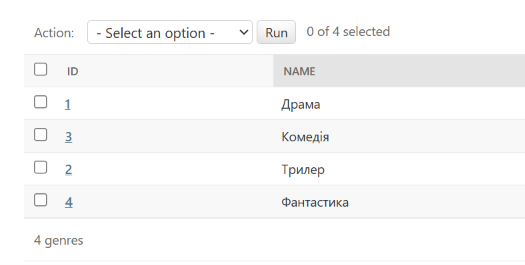
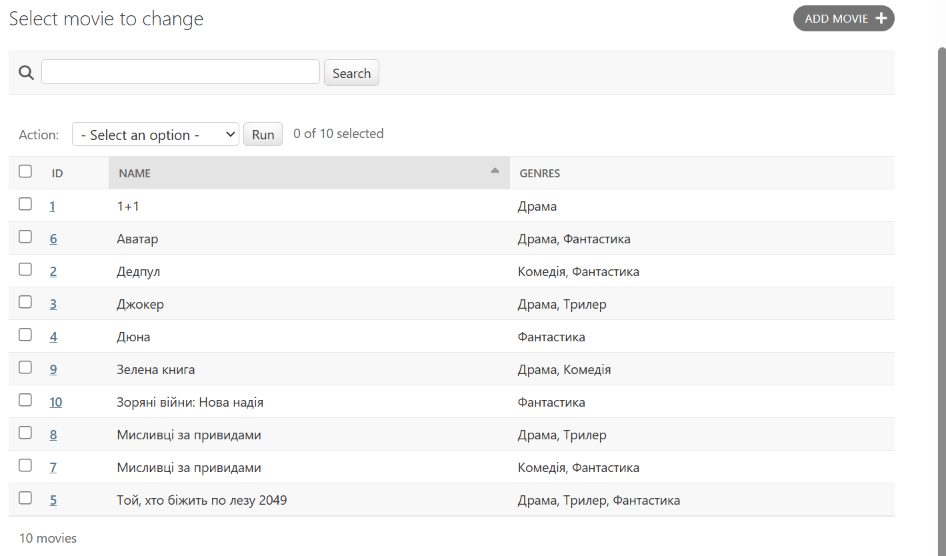
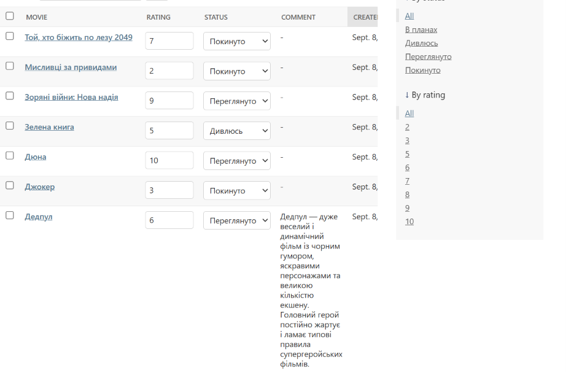

# Movie Collection Tracker

Django-застосунок для ведення власної колекції фільмів: жанри, статуси перегляду, оцінки та особисті відгуки.

## Моделі
- **Genre** — жанр фільму (Драма, Комедія, Наукова фантастика тощо).
- **Director** — режисер фільму (`ForeignKey` на модель `Movie`, `on_delete=SET_NULL`).
- **Movie** — фільм (зв'язок `ManyToManyField` на модель `Genre`, необов'язковий режисер, опис).
- **Review** — картка відгуку та статусу перегляду (`ForeignKey` на модель `Movie`), що містить оцінку від 1 до 10, випадаючий список статусів (`choices`), текстовий коментар і дату створення (`DateTimeField`).

## Сторінки та маршрути

Веб-інтерфейс побудований на Class-Based Views і має власний (не адмінський) UI зі спільним шаблоном `base.html` та єдиною системою стилів (картки, кнопки, теги, бейджі, форми, пагінація).

| Маршрут | View | Опис |
|---|---|---|
| `/` | `home` | Головна сторінка з переходами до фільмів і жанрів |
| `/movies/` | `MovieListView` | Список усіх фільмів (з пагінацією) |
| `/movies/top-rated/` | `TopRatedMoviesView` | Фільми з хоча б одним відгуком з оцінкою 8+ |
| `/movies/new/` | `MovieCreateView` | Форма додавання нового фільму |
| `/movies/<pk>/` | `MovieDetailView` | Деталі фільму: режисер, жанри, відгуки, інші фільми режисера |
| `/movies/<pk>/edit/` | `MovieUpdateView` | Форма редагування фільму |
| `/movies/<pk>/delete/` | `MovieDeleteView` | Підтвердження видалення фільму |
| `/genres/` | `genre_list` | Список жанрів із кількістю фільмів у кожному |
| `/admin/` | Django admin | Адмін-панель |

---

## Prerequisites & Package Manager

This project exclusively uses **uv**, a blazingly fast Python package manager written in Rust. Before starting, check if you have it installed:

```bash
uv --version
```

### Installing uv (If not installed)

If the command above is not recognized, install `uv` using one of the following official methods for your OS:

* **macOS / Linux:**

```bash
curl -LsSf https://astral.sh/uv/install.sh | sh
```

* **Windows (PowerShell):**

```powershell
powershell -ExecutionPolicy ByPass -c "irm https://astral.sh/uv/install.ps1 | iex"
```

---

## Quick Start

Setting up the project environment takes just a single command.

1. **Install all dependencies and setup environment:**

```bash
uv sync
```

*This command automatically creates an isolated virtual environment (`.venv`) and installs all project dependencies.*

2. **Activate the virtual environment:**

* **Windows (Command Prompt):**

```cmd
.venv\Scripts\activate
```

* **macOS / Linux:**

```bash
source .venv/bin/activate
```

---

## Database Setup & Run

1. **Застосувати міграції:**

```bash
python manage.py migrate
```

2. **Створити суперкористувача для адмінки:**

```bash
python manage.py createsuperuser
```

3. **Запустити локальний сервер:**

```bash
python manage.py runserver
```

Панель керування доступна за адресою: `http://127.0.0.1:8000/admin/`

4. **Запустити демонстраційний скрипт з ORM-запитами:**

```bash
python queries.py
```

---

## Скріншоти адмінки

### Жанри


### Фільми


### Відгуки

